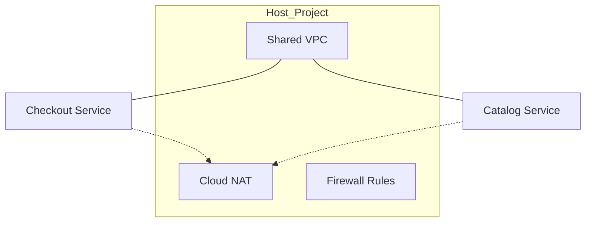

# Ejemplo: Diseño de Red para Microservicios Escalables

## Usuario

"Queremos migrar nuestra plataforma de e-commerce a microservicios. Necesitamos una red que sea segura, que permita a los equipos de desarrollo gestionar sus propios recursos pero que el equipo de red centralice la seguridad y el NAT."

## Razonamiento del Ingeniero de Redes (CoT)

1. **Intención**: El usuario busca un modelo de gobernanza delegada con control centralizado (Empresa/Organización).
2. **Topología**: La **Shared VPC** (VPC Compartida) es la solución ideal. Permite un Proyecto Host para la red y Proyectos de Servicio para los microservicios.
3. **Seguridad**: Se requiere segmentación por subredes y reglas de firewall jerárquicas. Cloud NAT se configurará en el Proyecto Host para dar salida a los microservicios sin IPs públicas.
4. **Conectividad**: Los servicios internos usarán balanceadores de carga internos (L7 LBs).

## Propuesta Técnica

### 1. Estructura de Proyectos

- **Host Project (`net-prod-host`)**: Contiene la VPC principal y el Cloud NAT Gateway.
- **Service Projects (`app-checkout-prod`, `app-catalog-prod`)**: Alojan los servicios en subredes compartidas.

### 2. Configuración de Red

### 3. Implementación de Cloud NAT

Se recomienda un Gateway de NAT por región (ej. `us-central1`) para alta disponibilidad, con asignación dinámica de IPs o estática si el destino requiere una whitelist.

### 4. Seguridad

- Utilizar **Network Endpoint Groups (NEGs)** para conectar los servicios a los balanceadores de carga.
- Habilitar **IAP** para que los administradores accedan a los logs sin exponer puertos SSH.
