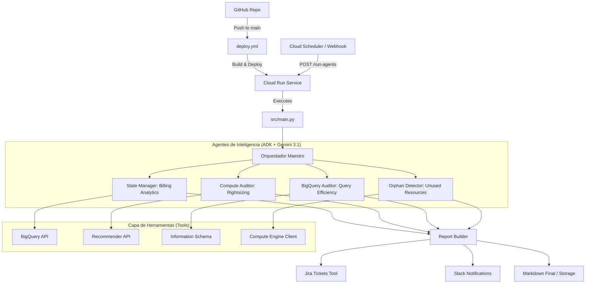

# 🏗️ Guía de Arquitectura: Ecosistema FinOps Multi-Agente v2.1.11

Este documento detalla el funcionamiento interno, la jerarquía de agentes y la infraestructura cloud que sustenta el sistema de optimización de costos de PiSA.

---

## 1. Diagrama de Flujo Lógico y CI/CD

El ecosistema se compone de una aplicación de código (Python/FastAPI) y un flujo de despliegue automatizado.

*   **`src/main.py`**: Es el punto de entrada (Entrypoint) de la aplicación. Define la API REST (FastAPI) que expone los endpoints para disparar la ejecución de los agentes (`/run-agents`).
*   **`Dockerfile`**: Define cómo empaquetar la aplicación en un contenedor. Utiliza `uvicorn` para servir `main.py`.
*   **`.github/workflows/deploy.yml`**: Es la tubería de CI/CD. Cada vez que se hace push a `main`, este workflow compila el código, construye la imagen de contenedor y la despliega automáticamente en **Cloud Run**.



---

## 2. Los Componentes del Ecosistema

### A. El Orquestador (`src/orchestrator.py`)

Es el cerebro táctico. Su función no es analizar, sino **dirigir**.

* Inicia una sesión de ejecución.
* Invoca a cada agente con un "Prompt" específico.
* Captura los resultados (eventos) de cada agente y los consolida en una estructura de datos unificada.

### B. Los Agentes (Capa Cognitiva)

Cada agente en `src/agents/` es una instancia de `google.adk.Agent`. Utilizan **Gemini 3.1** vía Vertex AI para:

1. **Razonar**: Decidir qué herramienta llamar según la instrucción del usuario.
2. **Analizar**: Interpretar los datos crudos (ej. un JSON de BigQuery) y convertirlos en recomendaciones humanas.
3. **Validar**: Asegurar que las recomendaciones cumplen con los thresholds de negocio (ej. > 10% de ahorro).

### C. Las Herramientas (Capa de Datos)

Ubicadas en `src/tools/`, son funciones Python puras que interactúan con GCP. Los agentes "ven" estas funciones como capacidades:

* **`billing.py`**: Consultas SQL complejas que calculan deltas de gasto.
* **`recommender.py`**: Interacción con el motor de recomendaciones de Google.
* **`jira_tickets.py`**: Capa de persistencia que garantiza que cada anomalía tenga un seguimiento formal.

---

## 3. Seguridad e Identidad (Workload Identity)

A diferencia de sistemas tradicionales, **no usamos contraseñas ni llaves API de Google** dentro del contenedor.

* **Service Account**: `1075963420777-compute@developer.gserviceaccount.com`.
* **Vertex AI Auth**: Al estar en Cloud Run, el SDK de Google detecta automáticamente la identidad de la cuenta de servicio y se autentica contra Vertex AI de forma invisible.
* **Secret Manager**: Solo el token de Jira (Atlassian) se almacena externamente y el código lo recupera dinámicamente en tiempo de ejecución.

---

## 4. Visualización de Resultados

Actualmente, el sistema genera reportes en formato **Markdown**. Tienes tres formas de visualizarlos:

1. **Logs de Cloud Run**: Cada ejecución imprime el reporte final en los logs. Es ideal para auditoría técnica.
2. **Jira Software**: El sistema crea o actualiza tickets en el tablero FinOps. La descripción del ticket contiene la tabla de anomalías y la recomendación específica.
3. **Slack**: Se envía un resumen ejecutivo al canal configurado con un enlace al reporte completo.
4. **Almacenamiento (Opcional)**: Podemos configurar el sistema para que guarde cada reporte como un archivo `.md` en un bucket de **Cloud Storage** (`gs://pisa-finops-reports/`).

---

## 5. Automatización (Scheduler)

Para asegurar que el ecosistema se ejecute sin intervención humana, utilizamos **Cloud Scheduler**.

* **Configuración Recomendada**: Una ejecución **diaria** (ej. 8:00 AM) para detectar anomalías lo antes posible.
* **Comando de Configuración**:

  ```powershell
  gcloud scheduler jobs create http finops-daily-run `
    --schedule="0 8 * * *" `
    --uri="https://finops-agents-1075963420777.us-central1.run.app/run-agents" `
    --http-method=POST `
    --location=us-central1
  ```
